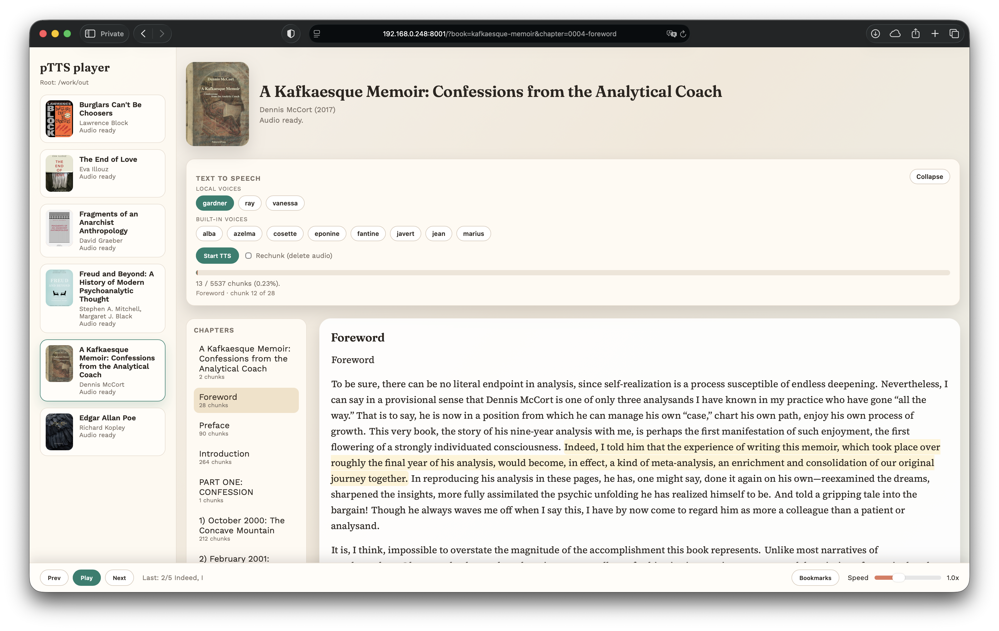

# pTTS: Narrate English books with Pocket-TTS



> ### Note
> As I am still using a vintage Intel MacBook Pro, many cool tools that use latest PyTorch or JAX cannot be run on it directly. I resort to using VMs via Podman. But on other compatible machines, Podman is not necessary at all. Just remove the `./bin/pmx` part and use `uv` directly.

## prerequisites

```bash
git clone <this-repo>
cd ~/pocket
mkdir -p .uv-cache .cache/huggingface
chmod +x bin/pmx

brew install podman
podman --version # tested with 5.7.1
podman machine init --cpus 6 --memory 8192 --disk-size 60 --now pocket-tts

# Install project dependencies into .venv (required for `ptts` CLI)
./bin/pmx uv sync

# To use voice cloning, you need to accept the terms via browser at https://huggingface.co/kyutai/pocket-tts
# Then you need to save the access token with correct permissions (I ticked everything in Repositories and Inference)
# This step can be skipped if no need for voice cloning
./bin/pmx uvx hf auth login

# Run once and test if it works in the web ui
PMX_OPTS="-p 8000:8000" ./bin/pmx uvx pocket-tts serve --host 0.0.0.0 --port 8000
```

## TTS a book

End-to-end workflow with podman:

### 1) Ingest EPUB into raw chapters
```bash
./bin/pmx uv run ptts ingest \
  --input books/Some-Book.epub \
  --out out/some-book
```

### 2) Sanitize (clean) chapters
```bash
./bin/pmx uv run ptts sanitize \
  --book out/some-book \
  --overwrite
```

### 3) Preview in a local web UI (optional)
```bash
PMX_OPTS="-p 8001:8001" ./bin/pmx uv run ptts preview \
  out/some-book \
  --host 0.0.0.0 \
  --port 8001
```

Open `http://localhost:8001` to review and adjust rules.

### 4) Synthesize audio (TTS)
```bash
./bin/pmx uv run --with pocket-tts ptts synth \
  --book out/some-book \
  --max-chars 800 \
  --pad-ms 150
```

By default, `ptts synth` uses the built-in voice `alba`. To choose a built-in voice
explicitly (or use a cloned wav), pass `--voice`:
```bash
./bin/pmx uv run --with pocket-tts ptts synth --book out/some-book --voice alba
./bin/pmx uv run --with pocket-tts ptts synth --book out/some-book --voice voices/ray.wav
```

### 5) Play in the web player
```bash
PMX_OPTS="-p 8002:8002" ./bin/pmx uv run ptts play \
  --root out \
  --host 0.0.0.0 \
  --port 8002
```

Open `http://localhost:8002` to browse books, start/stop TTS, and play audio.
Playback state is saved per book at `out/<book>/playback.json`.
If the player reports missing chunk spans, re-run TTS with `--rechunk`.

### 6) Merge to M4B
```bash
./bin/pmx uv run ptts merge \
  --book out/some-book \
  --output out/some-book/some-book.m4b
```

`ptts merge` requires `ffmpeg` on PATH. If you are using Podman, install it in the
same run (or use a custom image):
```bash
./bin/pmx bash -lc 'apt-get update && apt-get install -y ffmpeg && uv run ptts merge --book out/some-book --output out/some-book/some-book.m4b'
```

