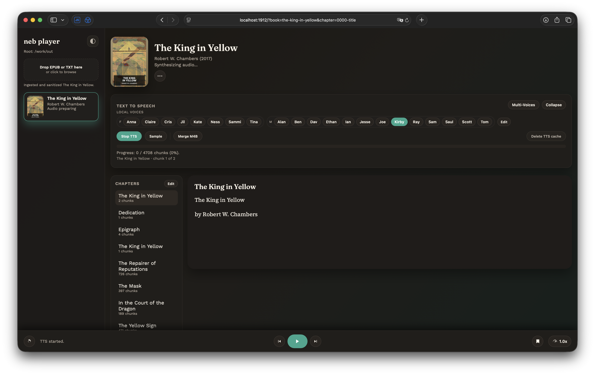

# neb: Narrate English Books



## Prerequisites

```bash
git clone https://github.com/huangziwei/neb && cd ~/neb
uv sync
```

## TTS a book

### via the local web app

```bash
uv run neb play \
  --root out \
  --host 0.0.0.0 \
  --port 1912
```

Open `http://localhost:1912`.

### via CLI

#### 1) Ingest EPUB or TXT into raw chapters
```bash
uv run neb ingest \
  --input books/Some-Book.epub \
  --out out/some-book
```

Plain text input works the same way:
```bash
uv run neb ingest \
  --input books/Some-Book.txt \
  --out out/some-book
```

#### 2) Sanitize (clean) chapters
```bash
uv run neb sanitize \
  --book out/some-book \
  --overwrite
```

#### 3) Synthesize audio (TTS)
```bash
uv run neb synth \
  --book out/some-book \
  --max-chars 400 \
  --pad-ms 300
```

#### 4) Merge to M4B
```bash
uv run neb merge \
  --book out/some-book \
  --output out/some-book/some-book.m4b
```

Merge auto-splits if the book is longer than 8 hours, keeping parts near-equal
and splitting only at chapter boundaries.

To override the split threshold:
```bash
uv run neb merge \
  --book out/some-book \
  --output out/some-book/some-book.m4b \
  --split-hours 8
```

`neb merge` requires `ffmpeg` on PATH (for macOS: `brew install ffmpeg`).
